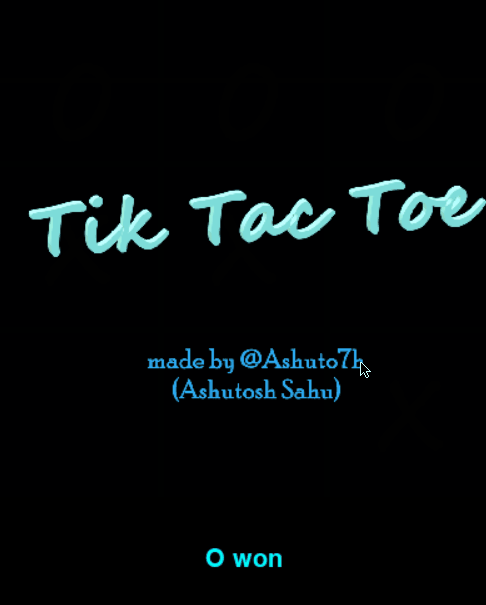

# Tic_Tac_Toe
a tic tac toe game for 2 players written in python,
using pygame library. 

:snowflake: thanks to my little sister Shalini :pouting_woman:  for image assets, made on paint 3D

## how to play
- clone repository or 
- download files : tic tac toe.py, O.png, X.png, Launch Text.png
- put them in a folder/dir
- run the tic tac toe.py

## contribute  
- help in including audio
- including an auto player
- improving ui
- generating a release.

thanks.:purple_heart:
